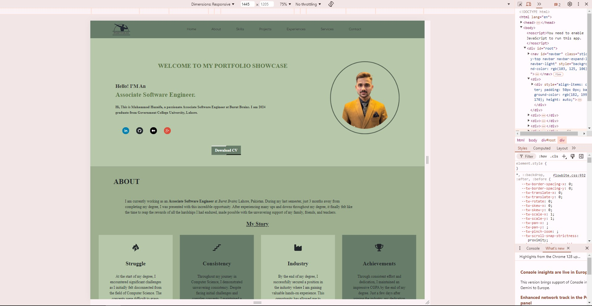

# Project Overview 🎓

This project has been an incredible opportunity to refine my skills and apply industry best practices.

## Design Process 🎨
The project began with a detailed blueprint in Figma, laying the foundation for the entire website. I transformed this design into a pixel-perfect, fully responsive site, significantly enhancing my development capabilities. 🎯

## Key Technologies and Insights
- **❄ React:** Leveraged this robust JavaScript library to deepen my understanding of states and hooks, creating dynamic and interactive features.
- **📱 Pixel-Perfect Design:** Ensured the site looks and functions flawlessly across all screen sizes using media queries.
- **🚀 Email Authentication:** Integrated Hunter.js for email authentication, ensuring emails are only sent when a valid address is provided.
- **🌀 Component-Based Development:** Built each section of the portfolio as a separate component, making the site modular and easy to scale.
- **🌎 Deployment:** Deployed the website on Vercel, making it accessible with a single click.

This project reflects my commitment to delivering high-quality, user-friendly web experiences. Feel free to explore the site and check out the code!

